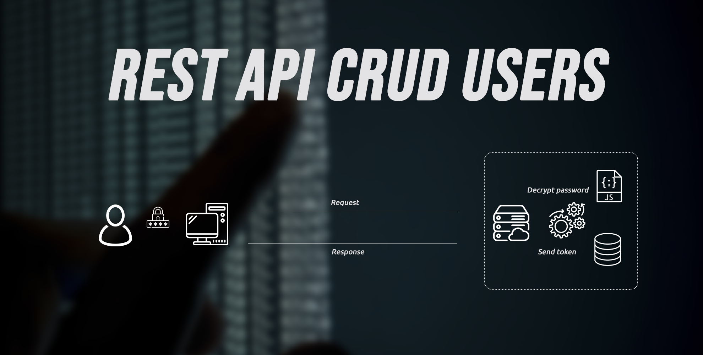
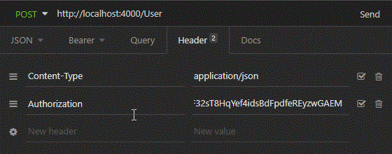
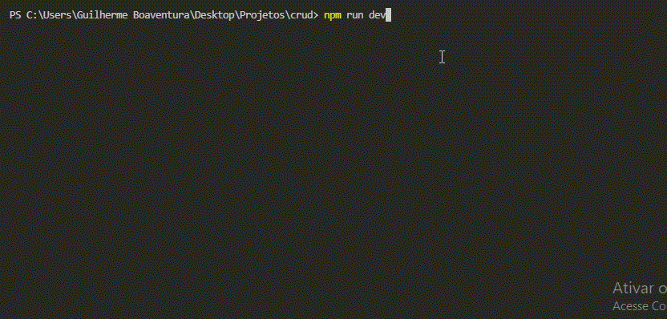
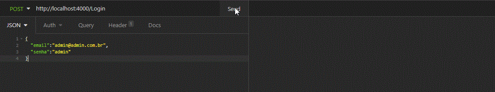
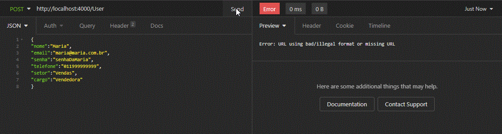
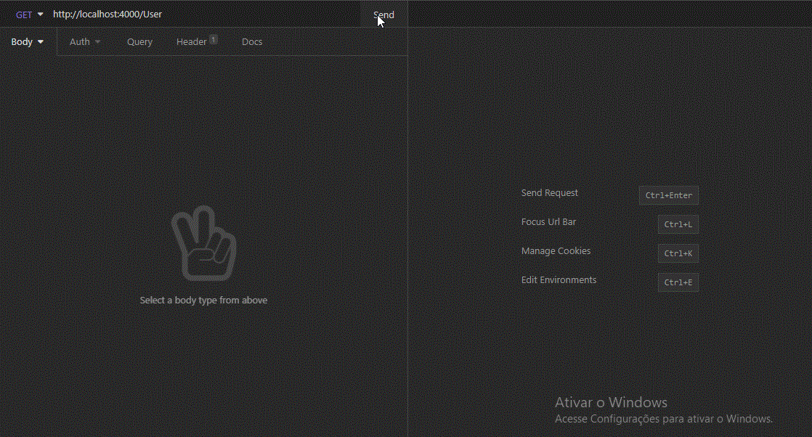
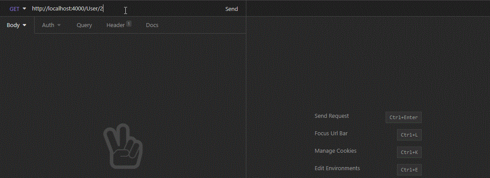
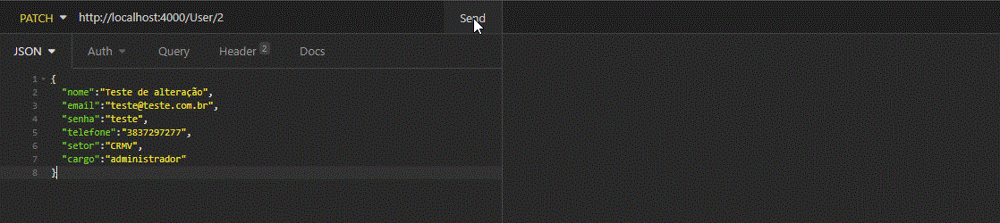
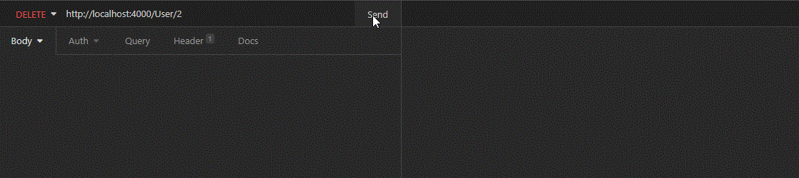
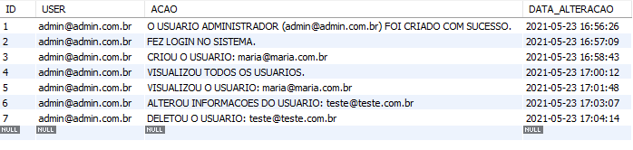

## Tabela de conteúdos

<!--ts-->
   * [Sobre](#sobre)
   * [Pré requisitos](#pré-requisitos)
   * [Instalação](#instalação)
   * [Regras de negócio](#regras-de-negócio)
   * [Como usar](#como-usar)
   * [Tecnologias](#tecnologias)
   * [Dependências](#dependências)
   * [Autor](#autor)
   * [Licença](#licença)
<!--te-->

## Sobre

Trata-se de uma Rest API que realiza as funções básicas de um crud de usuários, sendo cadastro, listagem, edição e exclusão.

A mesma conta com sistema de autenticação com criptografia através do [Bcrypt](https://www.npmjs.com/package/bcrypt) e emissão de tokens com o [JWT](https://jwt.io/).

Também foi utilizado a metodologia [RBAC](https://medium.com/@michael.svr/node-js-rest-api-with-rbac-jwt-repository-and-mvc-pattern-part-3-648c7b5a4700) para ter o controle de acesso dos usuários por cargo. Atualmente a API possui regra de negócio que somente o usuário administrador pode fazer a inserção e demais alterações.

## Pré-requisitos

Antes de começar, você vai precisar ter instalado em sua máquina as seguintes ferramentas:
[Git](https://git-scm.com), [Node.js](https://nodejs.org/en/). 
Além disto é bom ter um editor para trabalhar com o código como [VSCode](https://code.visualstudio.com/) e algum software para testar APIs como por exemplo o [Insomnia](https://insomnia.rest/) ou [Postamn](https://www.postman.com/).

## Instalação

A instalação da API é bem simples, será necessário realizar as confiruações abaixo:

### Clone o respositório

```` bash
git clone https://github.com/gcboaventura/api-rest-crud-de-usuarios.git
````

### Crie uma base de dados

Como já informado, precisamos que o MySQL esteja instalado em sua máquina. Será necessário criar uma base de dados com nome de sua preferência. 

```` bash
CREATE DATABASE CRUD;
````
### Instale as dependências

Dependências são necessárias para que o projeto funcione perfeitamente. Abra o terminal e execute o comando a seguir:

```` bash
npm install
````


### Variáveis de ambiente

O projeto possui a dependência Dotenv, a mesma é necessária para confifurar as variáveis de ambiente. Na raiz do projeto, crie um arquivo ".env" e atribua as variáveis conforme abaixo:

```` bash
# Atribua valores para as variáveis
# SERVER
serverPort_env = 4000

# DATABASE
hostDataBase_env = 
nameDataBase_env  = 
userDataBase_env  = 
passwordDataBase_env  = 
portDataBase_env  = 

# TOKEN
token_env = 
````
## Regras de negócio

Conforme já informado, foi utilizando a metodologia RBAC para realizar o controle de acesso, portanto, somente o usuário cadastrado com cargo de 'administrador' consegue fazer as alterações na base de dados.

Rotas protegidas: Post, Patch e Delete.

A visualização é permitida para todos os usuários.

## Como usar
* Content type

A aplicação está configurada para aceitar requisições em formato JSON.

````
{
   "chave": "valor"
}
````

* Token -Authorization

As rotas são protegidas com token, desta forma, o usuário que não esteja logado no sistema não irá conseguir visualizar ou realizar alterações no sistema.

Lembre-se de anexar ao header das requisições o Authorization: token fornecido e a classificação Content-type: application/json.



### Rodando o projeto

Após todas as configurações realizadas, execute o comando a seguir para rodar o projeto:

```` bash
npm run dev

# Será impresso no console as variáveis de ambiente e as informaçõe sobre criação de tabelas e usuário administrador.
````


### Login

Com a aplicação em funcionamento, efetue o login com os dados abaixo:

```` bash
# Rota http://localhost:4000/Login  - Método: POST

{
	"email":"admin@admin.com.br",
	"senha":"admin"
}

# Será fornecido o token como resposta.
````


### Cadastrar Usuário

Para cadastrar um usuário, faça o seguinte:

```` bash
# Rota http://localhost:4000/User  - Método: POST
# Exemplo de usuário

  {
	"nome":"Maria",
	"email":"maria@maria.com.br",
	"senha":"senhaDaMaria",
	"telefone":"011999999999",
	"setor":"Vendas",
	"cargo":"Vendedora"
  }

# A respota será as informações cadastradas.
````


### Visualizar todos os usuários

Para visualizar todos os usuários, faça o seguinte:

```` bash
# Rota http://localhost:4000/User  - Método: GET

# A respota será todos os usuários cadastrados.
````


### Filtrar usuário por ID

Para visualizar um usuário em específico, será necessário passar o ID como parâmetro. Faça da seguinte forma:

```` bash
# Rota http://localhost:4000/User/:id  - Método: GET

# A respota será o usuário.
````


### Editar informações do usuário

Para editar as informações do usuário, será necessário indentificá-lo pelo ID. Faça da seguinte forma:

```` bash
# Rota http://localhost:4000/User/:id  - Método: PATCH

{
	"nome":"Joao",
	"email":"Joao@Joao.com.br",
	"senha":"senhaDoJoao",
	"telefone":"011999999999",
	"setor":"Consultoria",
	"cargo":"Consultor"
}

# A resposta será uma mensagem de sucesso.
{
  "message": "Success."
}
````


### Excluindo usuário

Para excluir um usuário, será necessário indentificá-lo pelo ID. Faça da seguinte forma:

```` bash
# Rota http://localhost:4000/User/:id  - Método: DELETE

# A resposta será uma mensagem de sucesso.
{
  "message": "Success."
}
````


## Logs

Todas as alterações no sistema são monitoras por logs. Para visualizar todos os registros, acesse sua base no MySQL e execute o seguinte comando:

````bash

SELECT * FROM LOG;
# Será listado todos os registros até o momento
````


## Tecnologias

* [NodeJS](https://nodejs.org/en/)
* [MySQL](https://www.mysql.com/)

## Dependências

* [Bcrypt](https://www.npmjs.com/package/bcrypt)
* [Body parser](https://www.npmjs.com/package/body-parser)
* [Consign](https://www.npmjs.com/package/consign)
* [Dotenv](https://www.npmjs.com/package/dotenv)
* [Express](https://www.npmjs.com/package/express)
* [json Web Token](https://www.npmjs.com/package/jsonwebtoken)
* [Moment](https://www.npmjs.com/package/moment)
* [MySQL2](https://www.npmjs.com/package/mysql2)
* [Nodemon](https://www.npmjs.com/package/nodemon)

## Autor


Guilherme de Carvalho Boaventura

Me siga nas redes sociais !

* [LinkedIn](https://www.linkedin.com/in/guilherme-de-carvalho-boaventura-a63133175)
* [Instagram](https://www.instagram.com/gcboaventura/)

## Licença

The MIT License (MIT)

Copyright (c) 2021 Guilherme de Carvalho Boaventura

Permission is hereby granted, free of charge, to any person obtaining a copy of
this software and associated documentation files (the "Software"), to deal in
the Software without restriction, including without limitation the rights to
use, copy, modify, merge, publish, distribute, sublicense, and/or sell copies of
the Software, and to permit persons to whom the Software is furnished to do so,
subject to the following conditions:

The above copyright notice and this permission notice shall be included in all
copies or substantial portions of the Software.

The software is provided "as is", without warranty of any kind, express or
implied, including but not limited to the warranties of merchantability, fitness
for a particular purpose and noninfringement. In no event shall the authors or
copyright holders be liable for any claim, damages or other liability, whether
in an action of contract, tort or otherwise, arising from, out of or in
connection with the software or the use or other dealings in the software.